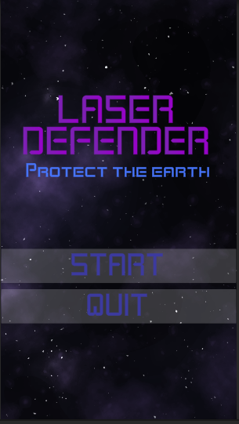

# 🚀 Laser-Defender

Unity 2D 탄막 슈팅 게임

## 🎮 게임 특징
- 👾 적 우주선과 탄막 회피, 타격 메커니즘
- 💥 스페이스바로 연속 발사되는 탄막 시스템
- 🛰️ 좌우 방향키로 플레이어 우주선 조작
- 🌌 우주 배경 속 몰입감 있는 전투 연출
- 🔊 박진감 넘치는 배경음악과 타격 사운드

## 📸 플레이 영상
https://youtu.be/WC9vJx0G150

## 🎮 조작법
- **← / → 방향키**: 플레이어 우주선 좌우 이동
- **Spacebar**: 탄막(총알) 발사

## 🛠️ 개발 도구
- **Engine**: Unity 2D
- **Language**: C#
- **Tools**: Unity Animator, Rigidbody2D, Tilemap, AudioSource
